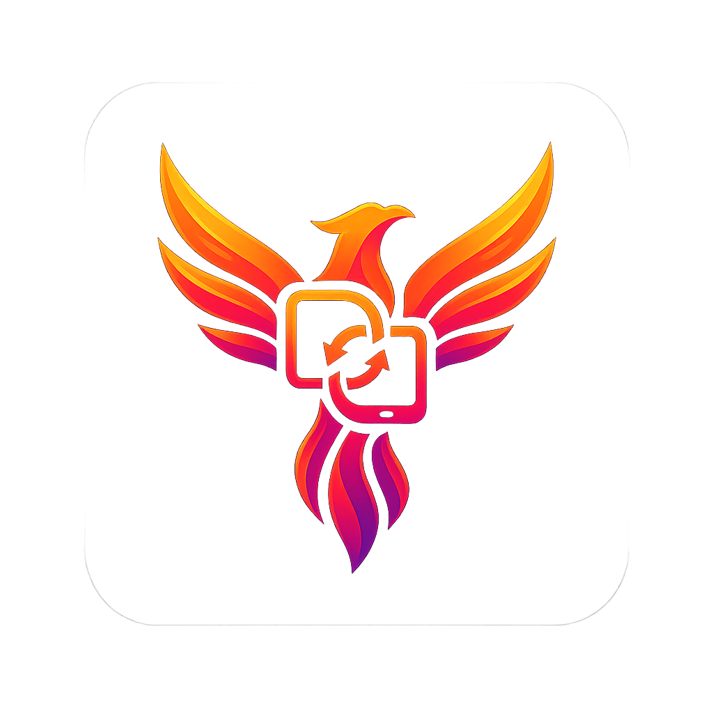

# FenixHub

<p align="center">
  
</p>

<p align="center">
  <strong>Comparte sin internet. Sin cuentas. Sin límites.</strong>
</p>

<p align="center">
  🌐 <strong>Sitio Web Oficial:</strong> <a href="https://fenixmotionsystems.com/projects/fenix-hub">fenixmotionsystems.com/projects/fenix-hub</a>
</p>

<p align="center">
  
  
  
  
</p>

---

## ¿Qué es FenixHub?

**FenixHub** es una aplicación de compartición de archivos local que funciona completamente **sin internet, sin cuentas y sin servidores externos**. Diseñada para redes domésticas, eventos, aulas o cualquier situación donde varios dispositivos necesiten intercambiar contenido de forma rápida y privada.

Todo el contenido que compartes se cifra en el dispositivo antes de enviarse usando **AES-256-GCM** (protocolo FNX2). Ningún servidor externo interviene en el proceso — la comunicación es siempre directa entre los dispositivos de tu red o en tu proximidad física. Cuando cierras la sesión, no queda ningún rastro en la nube porque nunca llegó a ella.

FenixHub ofrece tres modos de transferencia adaptados a cada situación: **LAN** para compartir con todos los dispositivos de tu red WiFi, **Direct** para transferencias privadas punto a punto, y **Mesh** para crear una sala de intercambio colectiva donde varios participantes comparten contenido de forma simultánea.

---

## Descargar

Descarga el APK directamente desde la página de releases de GitHub:

**[Descargar última versión →](https://github.com/Javiju555/fenix-hub/releases/latest)**

> **Nota sobre la instalación:** Al ser una aplicación distribuida fuera de Google Play, Android pedirá permiso para instalar desde fuentes desconocidas. Ve a **Ajustes → Aplicaciones → Acceso especial → Instalar apps desconocidas** y activa el permiso para tu navegador o gestor de archivos. Una vez instalada, puedes revocar ese permiso.

---

## Cómo funciona

### Modo LAN — Comparte en tu red WiFi

FenixHub escanea automáticamente los dispositivos de tu red local mediante **mDNS/NSD** (el mismo protocolo que usan AirPrint o Chromecast para descubrirse). Cuando publicas un archivo, imagen o texto, los demás dispositivos de la misma red lo ven al instante.

- **Descubrimiento automático:** no hace falta introducir IPs ni configurar nada manualmente.
- **Cifrado FNX2:** cada transferencia usa AES-256-GCM con una clave derivada de tu frase de acceso de grupo. Nadie más en la red puede leer el contenido.
- **Autenticación HMAC-SHA256:** cada petición HTTP lleva una firma criptográfica única que evita accesos no autorizados y ataques de repetición.
- **Streaming en disco:** los archivos grandes se cifran y descifran en bloques de 4 MB sin cargar el archivo entero en memoria.

### Modo Direct — Transferencia privada de cerca

Pensado para compartir con una persona concreta que está físicamente a tu lado, sin pasar por ninguna red WiFi existente. No necesitas tener WiFi — los dispositivos crean su propia conexión.

- **Descubrimiento por BLE:** tu dispositivo anuncia su presencia y escanea el entorno mediante Bluetooth Low Energy, similar a AirDrop.
- **Conexión WiFi Direct:** la transferencia real ocurre por WiFi Direct a velocidades de red local, sin depender de un router.
- **Sin infraestructura:** los dos dispositivos se conectan directamente entre sí. No requieren estar en la misma red WiFi.

### Modo Mesh — Sala colectiva cifrada

El modo más potente: un dispositivo actúa como anfitrión (HOST) y crea una sala a la que pueden unirse varios participantes simultáneamente.

1. **El HOST abre la sala** y empieza a anunciarla por BLE.
2. **Los dispositivos cercanos** ven la sala y solicitan unirse enviando su clave pública ECDH por BLE.
3. **El HOST acepta** a cada participante desde una pantalla de lobby. Nadie entra sin aprobación explícita.
4. **Las credenciales de conexión** (SSID, contraseña del grupo WiFi Direct) se envían cifradas al participante por BLE usando el intercambio de claves ECDH — nadie más puede interceptarlas.
5. **Los participantes se conectan** al grupo WiFi Direct del HOST y acceden al pool de contenido compartido.
6. **Modo fantasma:** el HOST puede cerrar el modal de invitaciones y la sala sigue activa. Al reabrirlo, puede invitar a más personas sin interrumpir a los ya conectados.
7. **Detección de desconexiones:** si un participante pierde la conexión, el HOST lo detecta en menos de 4 segundos y lo elimina automáticamente de la sala.

---

## Plataformas

| Plataforma | Estado |
|---|---|
| Android 10+ (API 29+) | Estable |
| Windows (Tauri + Rust) | En desarrollo |
| Linux (Tauri + Rust) | En desarrollo |
| macOS (Tauri + Rust) | En desarrollo |
| iOS (Swift + SwiftUI) | En desarrollo (requiere Mac + Xcode) |

### Capacidades por plataforma

| Capacidad | Android | iOS | Windows/Linux/macOS |
|---|---|---|---|
| **LAN discovery** (mDNS / Bonjour) | ✅ | ✅ | ✅ |
| **HTTP + HMAC + FNX2 publish** | ✅ | ✅ | ✅ |
| **HTTP pull de peers** | ✅ | 🔄 (fase 2) | ✅ |
| **WiFi Direct punto a punto** | ✅ | ❌ (no hay API pública) | ❌ |
| **Mesh (sala colectiva BLE + WiFi Direct)** | ✅ | ❌ | ❌ |
| **Crear hotspot programáticamente** | ✅ | ❌ | ❌ |
| **Foreground service persistente** | ✅ | ❌ (app se pausa en background) | ✅ |
| **Share Sheet** (enviar archivos a la app) | ✅ | ✅ (iOS Share Extension) | ✅ (drag & drop) |
| **Clipboard background monitoring** | ✅ | ❌ | ✅ |
| **Superposición flotante** | ✅ | ❌ | ❌ |
| **Recibir archivos guardándolos** | ✅ | 🔄 (fase 2) | ✅ |
| **Ventanas decoradas / barra de tareas** | ❌ | N/A | ✅ |

**Leyenda:** ✅ = funciona, 🔄 = en desarrollo/fase 2, ❌ = no viable por limitación del SO

---

## Compilar desde código fuente

### Requisitos previos

| Herramienta | Versión mínima | Necesaria para |
|---|---|---|
| Android Studio | Giraffe (2022.3) | Build Android |
| JDK | 17 | Build Android |
| Android SDK Build-Tools | 34 | Build Android |
| Node.js | 18+ | Frontend |
| Bun | 1.0+ | Frontend y scripts |
| Rust toolchain | stable | Desktop (Tauri) |

### Clonar el repositorio

```bash
git clone https://github.com/Javiju555/fenix-hub.git
cd fenix-hub
```

### Construir el frontend (WebView)

El frontend TypeScript es compartido entre Android y desktop. Debe compilarse antes del APK:

```bash
bun install
bun run build
```

### Construir el APK (debug)

```bash
cd android
./gradlew assembleDebug
```

El APK resultante estará en:

```
android/app/build/outputs/apk/debug/app-debug.apk
```

### Construir el APK (release)

Necesitas un keystore configurado. Establece las variables de entorno antes de ejecutar Gradle:

```bash
# Linux / macOS
export FENIXHUB_KEYSTORE_PATH=/ruta/a/tu/keystore.jks
export FENIXHUB_KEY_ALIAS=tu_alias
export FENIXHUB_STORE_PASSWORD=contraseña_store
export FENIXHUB_KEY_PASSWORD=contraseña_clave

# Windows (PowerShell)
$env:FENIXHUB_KEYSTORE_PATH = "C:\ruta\a\tu\keystore.jks"
$env:FENIXHUB_KEY_ALIAS = "tu_alias"
$env:FENIXHUB_STORE_PASSWORD = "contraseña_store"
$env:FENIXHUB_KEY_PASSWORD = "contraseña_clave"
```

```bash
cd android
./gradlew assembleRelease
```

### Construir el cliente de escritorio (Tauri)

```bash
# Dev (con hot-reload)
bun tauri dev

# Build de producción
bun tauri build
```

### Construir en macOS

Requisitos previos (además de los generales):

| Herramienta | Versión | Necesaria para |
|---|---|---|
| Xcode Command Line Tools | 15+ | Build macOS |
| Rust toolchain (stable) | — | Build Tauri backend |

```bash
# 1. Instalar Xcode CLT
xcode-select --install

# 2. Build frontend + desktop
bun install
cd frontend && bun install && bun run build
cd ..
bun tauri dev
```

Para empaquetar para un amigo:

```bash
bun tauri build --bundles app,dmg
```

> **Nota:** La primera vez macOS pedirá permiso de red local. Si no aparece, ve a
> **Ajustes del Sistema → Privacidad y Seguridad → Red local** y activa FenixHub.
> El build sin firmar requerirá "Abrir igualmente" en Gatekeeper.

### Construir iOS (requiere Mac con Xcode)

El código iOS está en `ios/FenixHubCore/` como un Swift Package independiente.
Para compilar en dispositivo real se necesita un Mac con Xcode 15+.

**Prerrequisitos:**

- Mac con Apple Silicon o Intel
- Xcode 15+
- Cuenta de desarrollador Apple (para instalación en dispositivo real)

**Pasos para compilar el Swift Package (modo librería):**

```bash
cd ios/FenixHubCore
swift build
swift test
```

**Pasos para generar el proyecto Xcode (app + Share Extension):**

1. Abre Xcode en el Mac.
2. File → New → Project → iOS App (SwiftUI).
3. Añade un target Share Extension.
4. Arrastra la carpeta `ios/FenixHubCore/` al proyecto.
5. Configura App Group (`group.com.fenixhub.mobile`) para compartir datos entre la app y la extensión.
6. Configura el URL scheme `fenixhub://` en el Info.plist del app target.
7. Build & Run en dispositivo.

> **Nota:** Mientras el proyecto Xcode no esté commitado (no se puede generar desde Linux),
> el Mac contributor debe seguir los pasos del plan en
> [`docs/plans/ios-foreground-port.md`](docs/plans/ios-foreground-port.md).

### Construir el AppImage en Arch Linux

En Arch, el `AppImage` de Tauri puede fallar aunque el binario y el `.deb` compilen bien. La causa típica es una incompatibilidad entre el `linuxdeploy` embebido y librerías modernas del sistema.

Para ese caso, este repositorio incluye una ruta de build que deja el `AppImage` final en la carpeta de bundles:

```bash
bun run build:appimage
```

Artefacto resultante:

```text
target/release/bundle/appimage/FenixHub_<version>_amd64.AppImage
```

### Tests

```bash
# Tests Rust (core)
cargo test -p fenix-hub-core

# Tests unitarios Android
cd android && ./gradlew :app:testDebugUnitTest
```

---

## Estructura del repositorio

```
fenix-hub/
├── android/          # App nativa Android (Kotlin + Jetpack Compose)
│   └── app/src/main/java/com/fenixhub/mobile/
│       ├── network/  # FenixHttpServer, MeshGattService, NsdController, WifiDirectTransferController
│       ├── service/  # FenixHubService (foreground), MeshManager
│       ├── model/    # MeshDevice, MeshState, ContentItem
│       └── web/      # AndroidHubBridge (WebView ↔ Kotlin)
├── frontend/         # UI TypeScript compartida (WebView en Android, web en desktop)
├── crates/           # Crates Rust compartidos (fenix-hub-core, fenix-hub-daemon)
├── src-tauri/        # Backend desktop (Tauri v2 + Rust)
├── docs/             # Documentación técnica y changelog
└── assets/           # Logo y recursos estáticos
```

---

## Seguridad

FenixHub fue diseñado con seguridad como requisito, no como añadido.

- **Sin datos en la nube:** todo ocurre en tu red local. No hay telemetría, no hay analytics, no hay cuentas.
- **Cifrado AES-256-GCM:** cada bloque de 4 MB usa un nonce único derivado del nonce base. Un fallo en un bloque no compromete los demás.
- **Autenticación por firma:** cada petición HTTP va firmada con HMAC-SHA256 sobre método, ruta, group_id, timestamp y nonce único. Los ataques de repetición se detectan con una ventana de 30 segundos.
- **ECDH para mesh:** las credenciales WiFi Direct nunca viajan en claro. Se cifran con la clave derivada del intercambio ECDH entre HOST y cada participante.
- **Sin contraseñas débiles:** la política de frase de acceso de grupo impone complejidad mínima.

Para un análisis detallado del modelo de seguridad, consulta [`docs/TECHNICAL.md`](docs/TECHNICAL.md).

---

## Contribuir

¿Quieres mejorar FenixHub? Cualquier contribución es bienvenida.

1. Abre un [issue](https://github.com/Javiju555/fenix-hub/issues) describiendo el bug o la mejora antes de empezar.
2. Haz un fork y crea una rama descriptiva (`feature/mesh-rekey`, `fix/nsd-leak`, etc.).
3. Asegúrate de que el proyecto compila y los tests pasan.
4. Abre un Pull Request con una descripción clara del cambio.

Para bugs de seguridad, contacta directamente en lugar de abrir un issue público.

### Áreas donde se agradece ayuda

- Finalizar el port iOS (app Xcode + Share Extension + pruebas en dispositivo real)
- Tests de integración para el protocolo FNX2
- Compatibilidad con dispositivos Huawei/EMUI (coexistencia WiFi Direct + WiFi STA)
- Mejoras de UI/UX en el frontend TypeScript

---

## Licencia

FenixHub se distribuye bajo la **[AGPL-3.0-only](LICENSE)**. Copyleft fuerte: cualquier fork que ofrezca este software como servicio de red debe publicar sus cambios bajo los mismos términos.

---

## English summary

**FenixHub** is a local file and content sharing app that works entirely offline — no internet, no accounts, no cloud. Nearby devices discover each other via mDNS (LAN mode), BLE + WiFi Direct (Direct mode), or a BLE-lobbied WiFi Direct mesh (Mesh mode). All transfers are encrypted with AES-256-GCM using the FNX2 streaming protocol and authenticated with HMAC-SHA256. Currently stable on Android 10+ (API 29+); Windows/Linux desktop via Tauri is in active development.

See [`docs/TECHNICAL.md`](docs/TECHNICAL.md) for the full technical reference.
